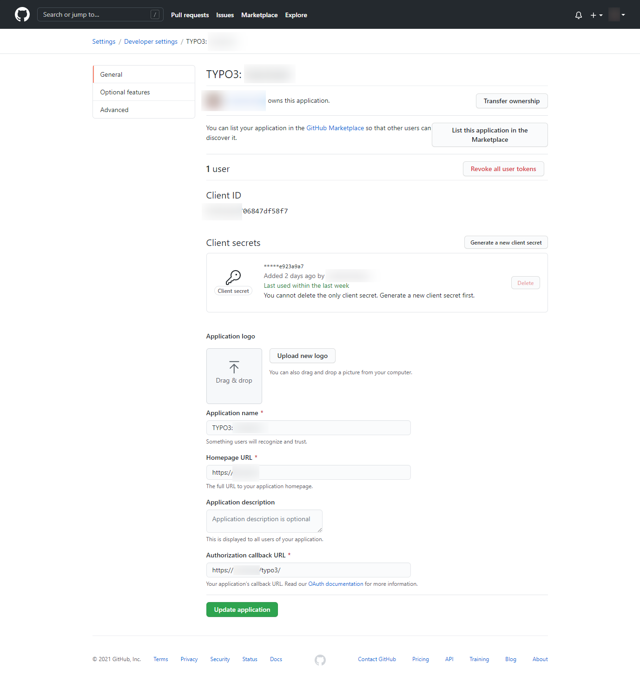

.. include:: ../Includes.txt

.. _configuration_github:

=========================
Configuration with Github
=========================

Adding the OAuth2 App in Github
===============================

-  Login to Github
-  Go to "Settings" > "Developer Settings" > "OAuth Apps" (https://github.com/settings/developers)
-  Click "new Oauth App"

   -  Enter your TYPO3 installation domain as Homepage URL
   -  Add the callback URI: `https://<your-TYPO3-installation>/typo3/`
- Save the application
- Copy the client secret and client id

Adding the OAuth2 Github App in TYPO3
=====================================

.. warning::

   Please use composer to install the Github provider: `composer require "league/oauth2-github:^2.0"`.
   If you did not install the specific provider, you can still use the `GenericProvider` - however, you
   will need to add the URL configuration yourself.

Add the following configuration to your `AdditionalConfiguration.php`:

.. code-block:: php

   $GLOBALS['TYPO3_CONF_VARS']['EXTENSIONS']['oauth2_client'] = [
       'providers' => [
           'github' => [
               'label' => 'Github',
               'description' => 'Login with your github.com user.',
               'iconIdentifier' => 'oauth2-github',
               'implementationClassName' => \League\OAuth2\Client\Provider\Github::class,
               'options' => [
                   'clientId' => '<your-client-id>',
                   'clientSecret' => '<your-client-secret>',
               ],
           ],
       ],
   ];

Registering the icon (optional)
===============================

If you want to use the Github icon, in your site package `ext_localconf.php` register the icon like this:

.. code-block:: php

   $iconRegistry = \TYPO3\CMS\Core\Utility\GeneralUtility::makeInstance(
       \TYPO3\CMS\Core\Imaging\IconRegistry::class
   );

   $iconRegistry->registerIcon(
       'oauth2-github',
       \TYPO3\CMS\Core\Imaging\IconProvider\FontawesomeIconProvider::class,
       ['name' => 'github']
   );

If you want to use the default icon instead, remove the `iconIdentifier` from the configuration.
