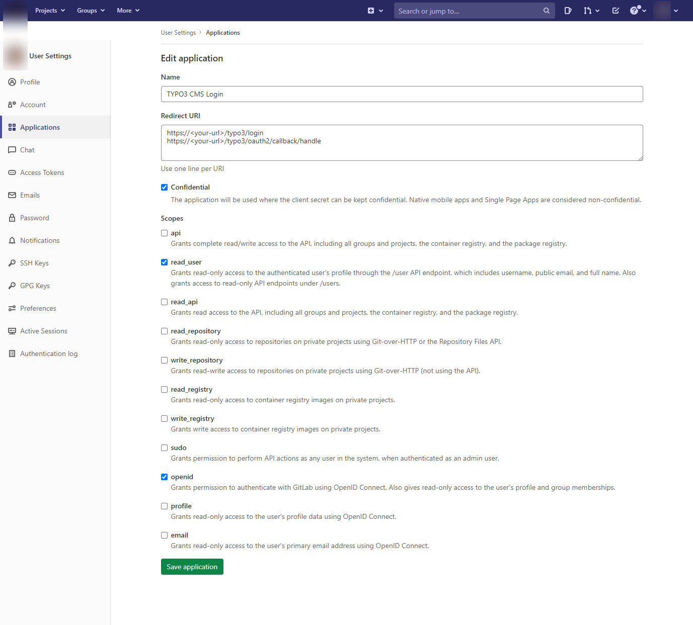
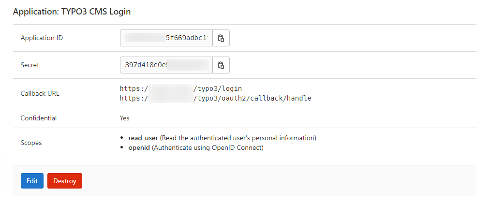

.. include:: ../Includes.txt

.. _configuration_gitlab:

=======================================
Configuration with Gitlab (self-hosted)
=======================================

.. note::

   This example contains the callback URLs which are required for TYPO3 v11.

Adding the OAuth2 app in Gitlab
===============================

-  Login to your Gitlab instance
-  Go to "User Settings" > "Applications"
-  Add a new application

   -  Add the redirect URIs (backend):

      -  `https://<your-TYPO3-installation>/typo3/login`
      -  `https://<your-TYPO3-installation>/typo3/oauth2/callback/handle`

   -  Add the redirect URIs (frontend):

      -  `https://<your-TYPO3-installation>/<callback-slug>`

   -  Set the application to "confidential"
   -  Set the scopes "openid" and "read_user"

-  Save the application
-  Copy the client secret and client id

Adding the OAuth2 Gitlab app in TYPO3
=====================================

Add the following configuration to your `AdditionalConfiguration.php`:

.. code-block:: php

   $GLOBALS['TYPO3_CONF_VARS']['EXTENSIONS']['oauth2_client'] = [
       'providers' => [
           'gitlab' => [
               'label' => 'Gitlab',
               'iconIdentifier' => 'oauth2-gitlab',
               'description' => 'Login with Gitlab',
               'implementationClassName' => \League\OAuth2\Client\Provider\GenericProvider::class,
               'scopes' => [
                   \Waldhacker\Oauth2Client\Service\Oauth2ProviderManager::SCOPE_BACKEND,
               ],
               'options' => [
                   'clientId' => '<your-client-id-from-gitlab>',
                   'clientSecret' => '<your-client-secret-from-gitlab>',
                   'urlAuthorize' => 'https://<url-to-your-gitlab>/oauth/authorize',
                   'urlAccessToken' => 'https://<url-to-your-gitlab>/oauth/token',
                   'urlResourceOwnerDetails' => 'https://<url-to-your-gitlab>/api/v4/user',
                   'scopes' => ['openid', 'read_user'],
                   'scopeSeparator' => ' '
               ],
           ],
       ],
   ];

Registering the icon (optional)
===============================

If you want to use a custom icon, in your site package `Configuration/Icons.php` register the icon like this:

.. code-block:: php

   <?php
      return [
          'oauth2-gitlab' => [
              'provider' => \TYPO3\CMS\Core\Imaging\IconProvider\FontawesomeIconProvider::class,
              'name' => 'gitlab',
          ],
      ];

If you want to use the default icon instead, remove the `iconIdentifier` from the configuration.
