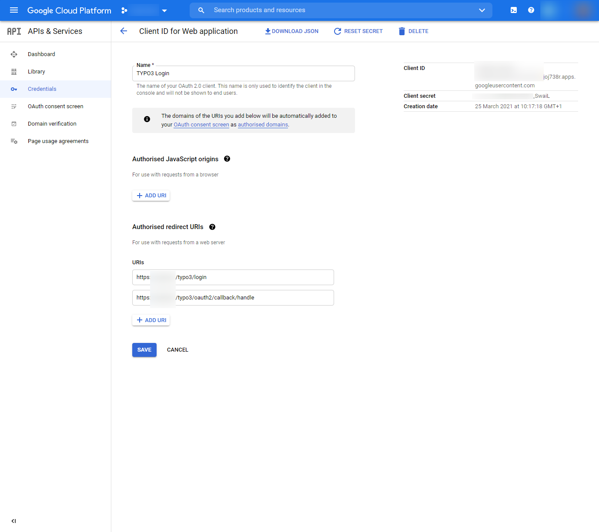

.. include:: ../Includes.txt

.. _configuration_google:

=========================
Configuration with Google
=========================

Adding the OAuth2 App in Google
===============================

-  Login to Google Developers Console (https://console.developers.google.com)
-  (Create a project if you have not done so already)
-  Click "Credentials" > "Create Credentials"

   -  Choose "Application type" > "Web Application"
   -  Enter a name for your application
   -  Add the redirect URIs: `https://<your-TYPO3-installation>/typo3/login` and `https://<your-TYPO3-installation>/typo3/oauth2/callback/handle`
- Save the application
- Copy the client secret and client id

Adding the OAuth2 Google App in TYPO3
=====================================

.. warning::

   Please use composer to install the Github provider: `composer require "league/oauth2-google:^4.0"`.
   If you did not install the specific provider, you can still use the `GenericProvider` - however, you
   will need to add the URL configuration yourself.

Add the following configuration to your `AdditionalConfiguration.php`:

.. code-block:: php

   $GLOBALS['TYPO3_CONF_VARS']['EXTENSIONS']['oauth2_client'] = [
       'providers' => [
           'google' => [
               'label' => 'Google',
               'iconIdentifier' => 'oauth2-google',
               'description' => 'Login with your Google user account.',
               'implementationClassName' => \League\OAuth2\Client\Provider\Google::class,
               'options' => [
                   'clientId' => '<client-id>',
                   'clientSecret' => '<client-secret>',
               ],
           ],
       ],
   ];

Registering the icon (optional)
===============================

If you want to use the Github icon, in your site package `ext_localconf.php` register the icon like this:

.. code-block:: php

   $iconRegistry = \TYPO3\CMS\Core\Utility\GeneralUtility::makeInstance(
       \TYPO3\CMS\Core\Imaging\IconRegistry::class
   );

   $iconRegistry->registerIcon(
       'oauth2-google',
       \TYPO3\CMS\Core\Imaging\IconProvider\FontawesomeIconProvider::class,
       ['name' => 'google']
   );

If you want to use the default icon instead, remove the `iconIdentifier` from the configuration.
