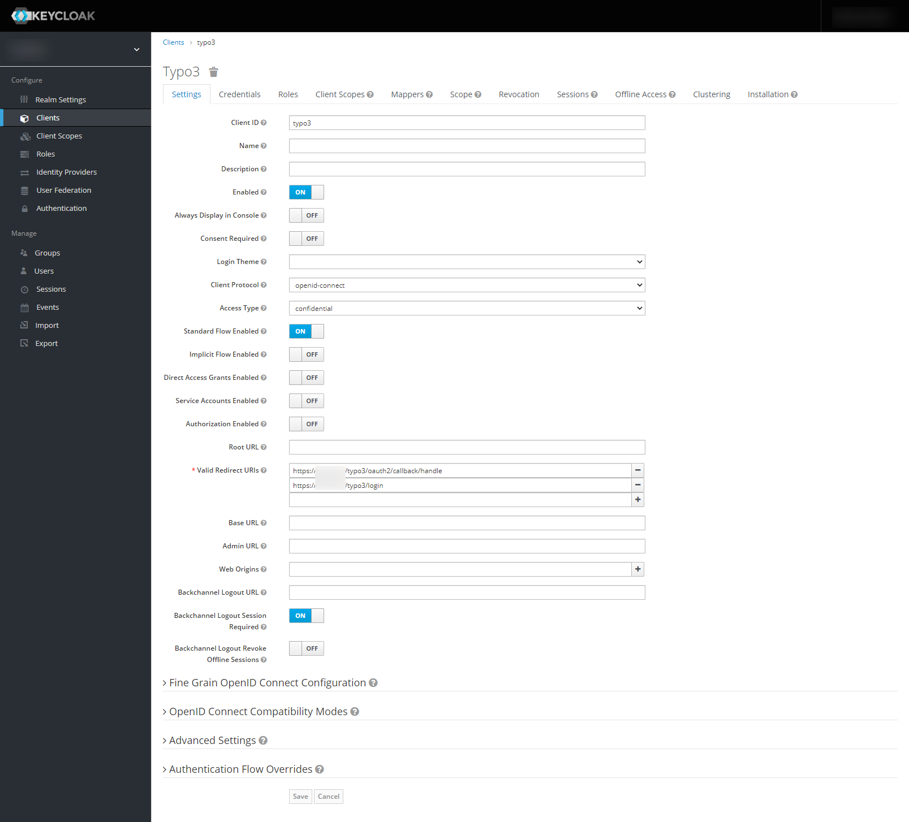
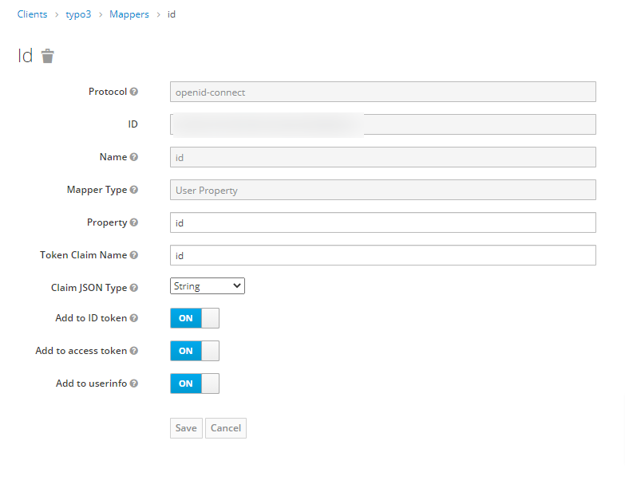

.. include:: ../Includes.txt

.. _configuration_keycloak:

===========================
Configuration with Keycloak
===========================

.. note::

   This example contains the callback URLs which are required for TYPO3 v11.

Adding the OAuth2 app in Keycloak
=================================

-  Login to your Keycloak Administration Console
-  Go to your realm and create a new Client with protocol "openid-connect" and access type "confidential"

   -  Enable the "Standard Flow"
   -  Add the redirect URIs (backend):

      -  `https://<your-TYPO3-installation>/typo3/login`
      -  `https://<your-TYPO3-installation>/typo3/oauth2/callback/handle`

   -  Add the redirect URIs (frontend):

      -  `https://<your-TYPO3-installation>/<callback-slug>`

   -  Save the client
   -  Switch to the "Mappers" tab and configure a mapper for the ID field (which is necessary to successfully connect to TYPO3), after clicking create:

      -  Enter "id" as :guilabel:`Name`
      -  Choose "User Property" as :guilabel:`Mapper Type`
      -  Enter "id" as :guilabel:`Property`
      -  Enter "id" as :guilabel:`Token Claim Name`
      -  Choose "String" as :guilabel:`Claim JSON Type`
      -  Check all three check boxes
      -  Save

-  Copy the client secret (Tab: Credentials) and client id

Adding the OAuth2 Keycloak app in TYPO3
=======================================

Add the following configuration to your `AdditionalConfiguration.php`:

.. code-block:: php

   $GLOBALS['TYPO3_CONF_VARS']['EXTENSIONS']['oauth2_client'] = [
       'providers' => [
           'keycloak' => [
               'label' => 'Keycloak',
               'iconIdentifier' => 'oauth2-keycloak',
               'description' => 'Login with Keycloak',
               'scopes' => [
                   \Waldhacker\Oauth2Client\Service\Oauth2ProviderManager::SCOPE_BACKEND,
               ],
               'options' => [
                   'clientId' => '<your-client-id>',
                   'clientSecret' => '<your-client-secret>',
                   'urlAuthorize' => 'https://<keycloak-domain>/auth/realms/<your-realm>/protocol/openid-connect/auth',
                   'urlAccessToken' => 'https://<keycloak-domain>/auth/realms/<your-realm>/protocol/openid-connect/token',
                   'urlResourceOwnerDetails' => 'https://<keycloak-domain>/auth/realms/<your-realm>/protocol/openid-connect/userinfo',
                   'responseResourceOwnerId' => 'sub',
               ],
           ],
       ],
   ];

Registering the icon (optional)
===============================

If you want to use a custom icon, in your site package `Configuration/Icons.php` register the icon like this:

.. code-block:: php

   <?php
      return [
          'oauth2-keycloak' => [
              'provider' => \TYPO3\CMS\Core\Imaging\IconProvider\FontawesomeIconProvider::class,
              'name' => 'key',
          ],
      ];

If you want to use the default icon instead, remove the `iconIdentifier` from the configuration.
