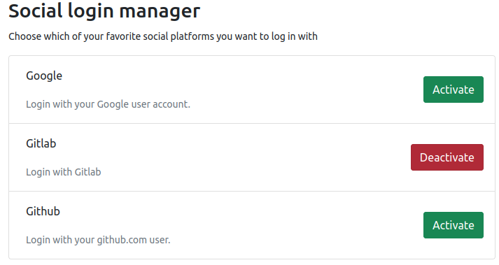

.. include:: ../Includes.txt

.. _developer_information:

=====================
Developer information
=====================

Basic backend authentication flows
==================================

Login flow
----------

.. uml::

   skinparam backgroundColor #EEE
   skinparam handwritten false
   skinparam sequence {
       ArrowColor DarkGreen
       ArrowFontSize 18
       ParticipantBorderColor ForestGreen
       ParticipantFontSize 20
       ParticipantBackgroundColor TECHNOLOGY
   }

   autonumber

   "TYPO3 Backend" -> "BackendAuthenticationService": Request OAuth2 login
   "BackendAuthenticationService" -> "BackendAuthenticationService": Generate / set state (session)
   "BackendAuthenticationService" -> "OAuth2 Provider": Authentication request (redirect)
   note left of "OAuth2 Provider"
       User enters their provider credentials
       and grants access.
   end note
   "OAuth2 Provider" -> "BackendAuthenticationService": Redirect to callback-url\nand provide access code & state
   "BackendAuthenticationService" -> "BackendAuthenticationService": Validate state (session)
   "BackendAuthenticationService" -> "OAuth2 Provider": Fetch AccessToken by access code
   "OAuth2 Provider" -> "BackendAuthenticationService": Provide AccessToken
   "BackendAuthenticationService" -> "OAuth2 Provider": Fetch ResourceOwner by AccessToken
   "OAuth2 Provider" -> "BackendAuthenticationService": Provide ResourceOwner
   "BackendAuthenticationService" -> "BackendAuthenticationService": Match by ResourceOwner ID\n& Provider ID
   "BackendAuthenticationService" -> "BackendAuthenticationService": Fire BackendUserLookupEvent
   "BackendAuthenticationService" -> "TYPO3 Login": Return found user
   "TYPO3 Login" -> "TYPO3 Login": (optional) Evaluate MFA
   "TYPO3 Login" -> "TYPO3 Backend": Redirect to the backend

   @enduml

Registering new OAuth2 provider for backend user
------------------------------------------------

.. uml::

   skinparam backgroundColor #EEE
   skinparam handwritten false
   skinparam sequence {
       ArrowColor DarkGreen
       ArrowFontSize 18
       ParticipantBorderColor ForestGreen
       ParticipantFontSize 20
       ParticipantBackgroundColor TECHNOLOGY
       NoteBackgroundColor ForestGreen
       NoteBorderColor ForestGreen
       NoteShadowing false
   }

   autonumber

   "TYPO3 Backend" -> "AuthorizeController (OAuth2 Popup)": User setup module opens a popup
   "AuthorizeController (OAuth2 Popup)" -> "AuthorizeController (OAuth2 Popup)": Generate / set state (session)
   "AuthorizeController (OAuth2 Popup)" -> "OAuth2 Provider": Request for\napplication registration (redirect)
   note left of "OAuth2 Provider"
       User enters their provider credentials
       and grants access.
   end note
   "OAuth2 Provider" -> "AuthorizeController (OAuth2 Popup)": Redirect to callback-url\nand provide access code & state
   "AuthorizeController (OAuth2 Popup)" -> "VerifyController": Post message with access code\n& state for evaluation
   "VerifyController" -> "VerifyController": Validate state (session)
   "VerifyController" -> "OAuth2 Provider": Fetch AccessToken by access code
   "OAuth2 Provider" -> "VerifyController": Provide AccessToken
   "VerifyController" -> "OAuth2 Provider": Fetch ResourceOwner by AccessToken
   "OAuth2 Provider" -> "VerifyController": Provide ResourceOwner
   "VerifyController" -> "VerifyController": Store\nprovider-ID\n& ResourceOwner-ID\n& TYPO3-user-ID\nin database
   "VerifyController" -> "TYPO3 Backend": Redirect to user setup module
   @enduml

Creating backend users
----------------------

This extension does not provide the possibility to create backend users on the fly itself.
Its purpose is to provide OAuth2 authentication only. To allow backend users to register
directly via OAuth2, the extension comes with a PSR-14 event
:php:`Waldhacker\Oauth2Client\Events\BackendUserLookupEvent`
that can be used to create the backend users.
With the next release of this extension this documentation will explain
how an implementation can look like. Furthermore, a reference implementation
for user registration via Gitlab will be published soon.

Basic frontend authentication flows
===================================

Login flow
----------

.. uml::

   skinparam backgroundColor #EEE
   skinparam handwritten false
   skinparam sequence {
       ArrowColor DarkGreen
       ArrowFontSize 18
       ParticipantBorderColor ForestGreen
       ParticipantFontSize 20
       ParticipantBackgroundColor TECHNOLOGY
   }

   autonumber

   "TYPO3 Frontend" -> "FrontendAuthenticationService": Request OAuth2 login
   "FrontendAuthenticationService" -> "FrontendAuthenticationService": Generate / set state (session)
   "FrontendAuthenticationService" -> "OAuth2 Provider": Authentication request (redirect)
   note left of "OAuth2 Provider"
       User enters their provider credentials
       and grants access.
   end note
   "OAuth2 Provider" -> "FrontendAuthenticationService": Redirect to callback-url\nand provide access code & state
   "FrontendAuthenticationService" -> "FrontendAuthenticationService": Validate state (session)
   "FrontendAuthenticationService" -> "OAuth2 Provider": Fetch AccessToken by access code
   "OAuth2 Provider" -> "FrontendAuthenticationService": Provide AccessToken
   "FrontendAuthenticationService" -> "OAuth2 Provider": Fetch ResourceOwner by AccessToken
   "OAuth2 Provider" -> "FrontendAuthenticationService": Provide ResourceOwner
   "FrontendAuthenticationService" -> "FrontendAuthenticationService": Match by ResourceOwner ID\n& Provider ID
   "FrontendAuthenticationService" -> "FrontendAuthenticationService": Fire FrontendUserLookupEvent
   "FrontendAuthenticationService" -> "TYPO3 Login": Return found user
   "TYPO3 Login" -> "TYPO3 Frontend": Return to the location from which the OAuth2 login was made
   @enduml

Registering new OAuth2 provider for frontend user
-------------------------------------------------

.. uml::

   skinparam backgroundColor #EEE
   skinparam handwritten false
   skinparam sequence {
       ArrowColor DarkGreen
       ArrowFontSize 18
       ParticipantBorderColor ForestGreen
       ParticipantFontSize 20
       ParticipantBackgroundColor TECHNOLOGY
       NoteBackgroundColor ForestGreen
       NoteBorderColor ForestGreen
       NoteShadowing false
   }

   autonumber

   "TYPO3 Frontend" -> "RegistrationController": Request OAuth2 registration
   "RegistrationController" -> "RegistrationController": Generate / set state (session)
   "RegistrationController" -> "OAuth2 Provider": Request for\napplication registration (redirect)
   note left of "OAuth2 Provider"
       User enters their provider credentials
       and grants access.
   end note
   "OAuth2 Provider" -> "RegistrationController": Redirect to callback-url\nand provide access code & state
   "RegistrationController" -> "RegistrationController": Validate state (session)
   "RegistrationController" -> "OAuth2 Provider": Fetch AccessToken by access code
   "OAuth2 Provider" -> "RegistrationController": Provide AccessToken
   "RegistrationController" -> "OAuth2 Provider": Fetch ResourceOwner by AccessToken
   "OAuth2 Provider" -> "RegistrationController": Provide ResourceOwner
   "RegistrationController" -> "RegistrationController": Store\nprovider-ID\n& ResourceOwner-ID\n& TYPO3-user-ID\nin database
   "RegistrationController" -> "TYPO3 Frontend": Return to the location from which the OAuth2 registration was made
   @enduml

Creating frontend users
-----------------------

This extension does not provide the possibility to create frontend users on the fly itself.
Its purpose is to provide OAuth2 authentication only. To allow frontend users to register
directly via OAuth2, the extension comes with a PSR-14 event
:php:`Waldhacker\Oauth2Client\Events\FrontendUserLookupEvent`
that can be used to create the frontend users.
With the next release of this extension this documentation will explain
how an implementation can look like. Furthermore, a reference implementation
for frontend user registration via Gitlab will be published soon.

Frontend integration
====================

Login
-----

An OAuth2 login is possible on all TYPO3 pages that are configured to allow logins

(`Page Settings` -> Tab :guilabel:`Access` -> :guilabel:`Login Behaviour` (`fe_login_mode`)).

It is not mandatory to use a login plugin like `fe_login`.
A link in the form of :html:`https://your-typo3-site.example.com/some-site?oauth2-provider=<provider-identifier>&logintype=login` is sufficient.
However, if you want to use social login buttons in the `fe_login` template, the `oauth2_client` extension already comes with an integration for that.

The extension provides a variable named :html:`oauth2Providers` in the fe_login template.
This variable contains all the information you defined in :php:`$GLOBALS['TYPO3_CONF_VARS']['EXTENSIONS']['oauth2_client']['providers']`.
In the template you can now use this variable to create the social login buttons:

.. code-block:: html

   <f:for each="{oauth2Providers}" as="provider">
       <core:icon identifier="{provider.iconIdentifier}" size="large" />
       <button type="submit" name="oauth2-provider" value="{provider.identifier}">
           Login with {provider.label}
       </button>
   </f:for>

.. figure:: ../Images/Frontend/loginScreen.png
   :class: with-shadow
   :alt: TYPO3 frontend login screen with configured OAuth2 providers
   :width: 300px

   TYPO3 frontend login screen with configured OAuth2 providers

Registration
------------

To give logged in users the possibility to choose with which OAuth2 provider they want to log in in the future, the `oauth2_client` brings a plugin for this purpose.
This plugin is called :guilabel:`Manage OAuth2 providers` (`oauth2client_manageproviders`).

This plugin can be placed, for example, on the user profile page and allows the website visitor to activate and deactivate social logins.

   Let a logged in frontend user choose which OAuth2 provider to log in with

The template of this plugin is intentionally kept rudimentary because it is assumed that you want to overwrite this template to adapt it to the needs of your frontend.
Nevertheless it is implemented bootstrap5 compatible to provide a certain basic styling.

To override the templates within your site package you have to add the following typoscript to your site package

.. code-block:: typoscript

   plugin.tx_oauth2client {
       view {
           templateRootPaths.100 = EXT:site_package/Resources/Private/Templates/
           partialRootPaths.100 = EXT:site_package/Resources/Private/Partials/
       }
   }

Now you can copy and style the original templates under the following paths:

* `Resources/Private/Templates/Frontend/ManageProviders/List.html`
* `Resources/Private/Partials/Frontend/ManageProviders/ProviderItem.html`

Migration from version 1.x to 2.x
=================================

The table :sql:`tx_oauth2_client_configs` that used in version 1.x to contain the registered OAuth2 providers for backend users has been renamed to :sql:`tx_oauth2_beuser_provider_configuration` in version 2.x.
To migrate the data there is an upgrade wizard named :guilabel:`Migrate OAuth2 table tx_oauth2_client_configs to tx_oauth2_beuser_provider_configuration`.
Please run this wizard after you have updated to version 2.x.

