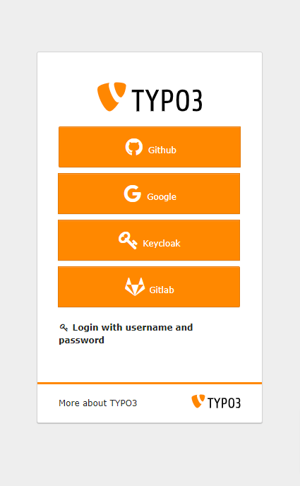
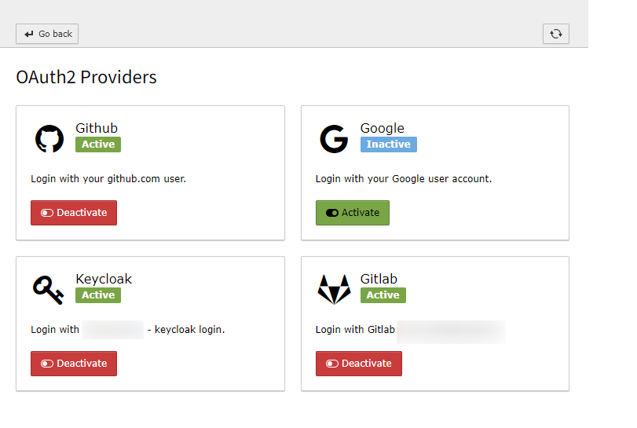
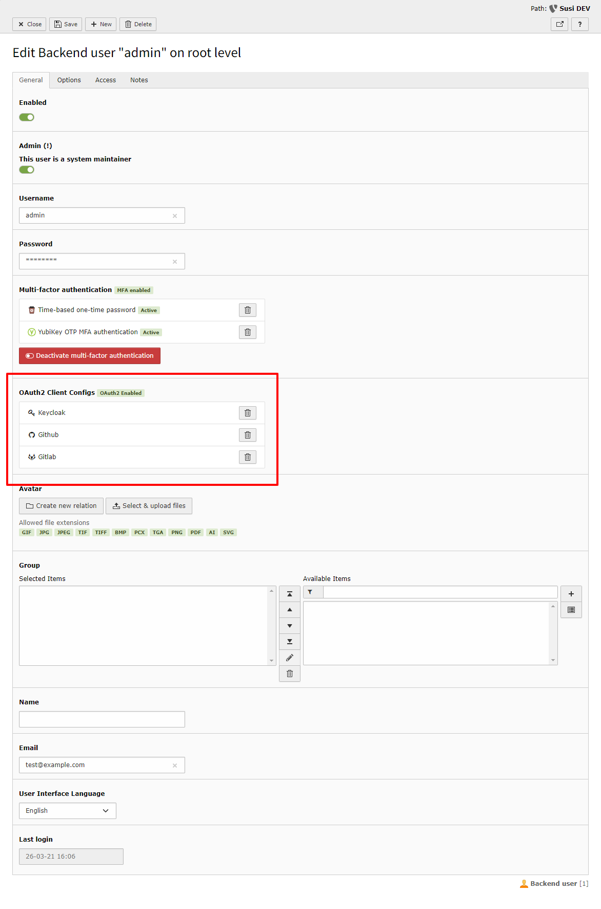

.. include:: ../Includes.txt

.. _introduction:

============
Introduction
============

.. _what-it-does:

What does it do?
================

Allow your backend users to add login possibilities via any OAuth2 provider. Popular examples are Github or Gitlab, Google, Facebook
or LinkedIn or classically self-hosted solutions like Keycloak.

The extension allows administrators/integrators to configure various providers and offers any backend user an interface to add their
OAuth2 based login.

This extension is especially powerful in combination with the Multi-Factor Capabilities of TYPO3 as you can provide users with a single-sign-on login of their choice and add additional security of MFA to TYPO3.

   Login with any available provider.

   Manage provider configuration

   Use in conjunction with MFA.
