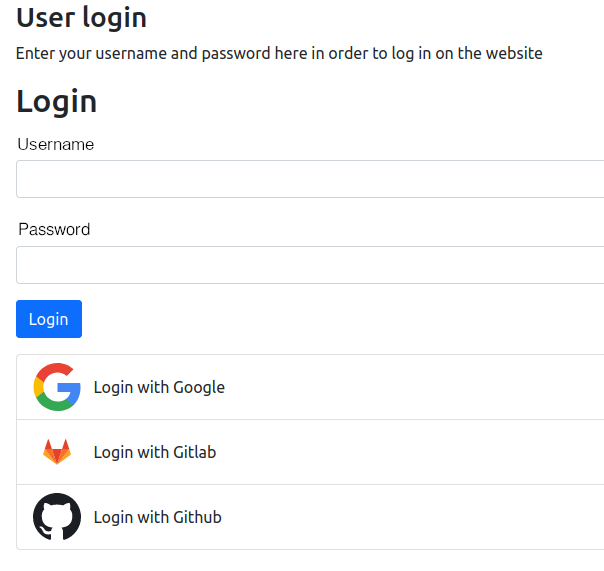

.. include:: ../Includes.txt

.. _introduction:

============
Introduction
============

.. _what-it-does:

What does it do?
================

TYPO3 Backend
^^^^^^^^^^^^^

Allow your backend users to add login possibilities via any OAuth2 provider. Popular examples are Github or Gitlab, Google, Facebook
or LinkedIn or classically self-hosted solutions like Keycloak.

The extension allows administrators/integrators to configure various providers and offers any backend user an interface to add their
OAuth2 based login.

This extension is especially powerful in combination with the Multi-Factor Capabilities of TYPO3 as you can provide users with a single-sign-on login of their choice and add additional security of MFA to TYPO3.

.. figure:: ../Images/Backend/loginScreen.png
   :class: with-shadow
   :alt: TYPO3 backend login screen
   :width: 300px

   Login with any available provider.

.. figure:: ../Images/Backend/configuredProviders.png
   :class: with-shadow
   :alt: TYPO3 backend user configured OAuth2 providers
   :width: 600px

   Manage provider configuration.

   Use in conjunction with MFA.

TYPO3 Frontend
^^^^^^^^^^^^^

Allow your frontend users to add login possibilities via any OAuth2 provider. Popular examples are Github or Gitlab, Google, Facebook
or LinkedIn or classically self-hosted solutions like Keycloak.

The extension allows administrators/integrators to configure various providers on a site or site language level and offers any frontend user an interface to add their
OAuth2 based login.

   Let a frontend user login with any available provider.

.. figure:: ../Images/Frontend/configuredProviders.png
   :class: with-shadow
   :alt: TYPO3 frontend user configured OAuth2 providers
   :width: 600px

   Let a frontend user manage provider activations.

.. figure:: ../Images/Frontend/administrateAvailableProviders.png
   :class: with-shadow
   :alt: TYPO3 site language configured OAuth2 providers
   :width: 600px

   Administrate available providers on a site or site language level.

   Revoke frontend user provider activations.
