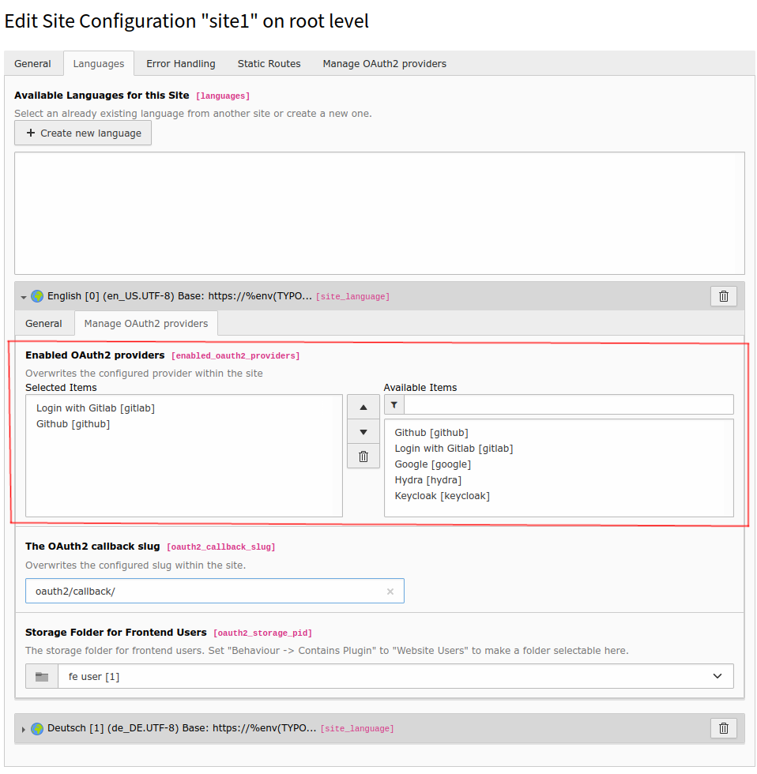

.. include:: ../Includes.txt

.. _introduction:

============
Introduction
============

.. _what-it-does:

What does it do?
================

TYPO3 Backend
^^^^^^^^^^^^^

Allow your backend users to add login possibilities via any OAuth2 provider. Popular examples are Github or Gitlab, Google, Facebook
or LinkedIn or classically self-hosted solutions like Keycloak.

The extension allows administrators/integrators to configure various OAuth2 providers and offers any backend user an interface to add their
OAuth2 based login.

This extension is especially powerful in combination with the Multi-Factor Capabilities of TYPO3 as you can provide users with a single-sign-on login of their choice and add additional security of MFA to TYPO3.

.. figure:: ../Images/Backend/loginScreen.png
   :class: with-shadow
   :alt: TYPO3 backend login screen with configured OAuth2 providers
   :width: 300px

   Let a backend user login with any available OAuth2 provider.

   Let a backend user choose which OAuth2 provider to log in with via user setup module.

.. figure:: ../Images/Backend/beUser.png
   :class: with-shadow
   :alt: TYPO3 backend user configuration with enabled OAuth2 logins and Multi-Factor authentication
   :width: 600px

   Use OAuth2 in conjunction with Multi-Factor authentication.

TYPO3 Frontend
^^^^^^^^^^^^^

Allow your frontend users to add login possibilities via any OAuth2 provider. Popular examples are Github or Gitlab, Google, Facebook
or LinkedIn or classically self-hosted solutions like Keycloak.

The extension allows administrators/integrators to configure various OAuth2 providers on a site or site language level and offers any frontend user an interface to add their
OAuth2 based login.

.. figure:: ../Images/Frontend/loginScreen.png
   :class: with-shadow
   :alt: TYPO3 frontend login screen
   :width: 600px

   Let a frontend user login with any available OAuth2 provider.

.. figure:: ../Images/Frontend/configuredProviders.png
   :class: with-shadow
   :alt: TYPO3 frontend plugin with configured OAuth2 providers
   :width: 600px

   Let a logged in frontend user choose which OAuth2 provider to log in with

   Administrate available OAuth2 providers on a site or site language level.

.. figure:: ../Images/Frontend/feUser.png
   :class: with-shadow
   :alt: TYPO3 frontend user configuration with enabled OAuth2 logins
   :width: 600px

   Revoke frontend user OAuth2 provider activations.
