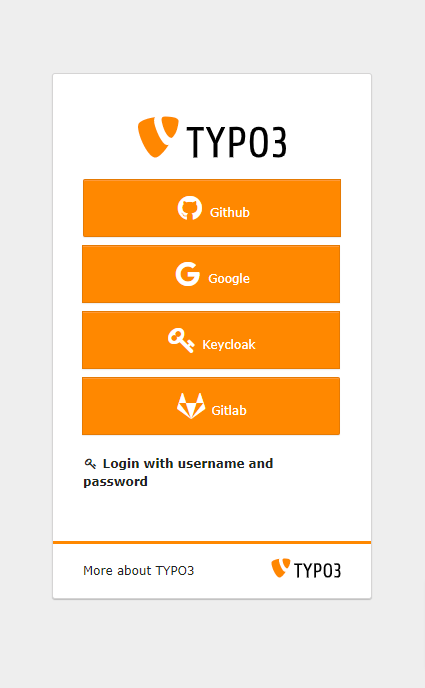
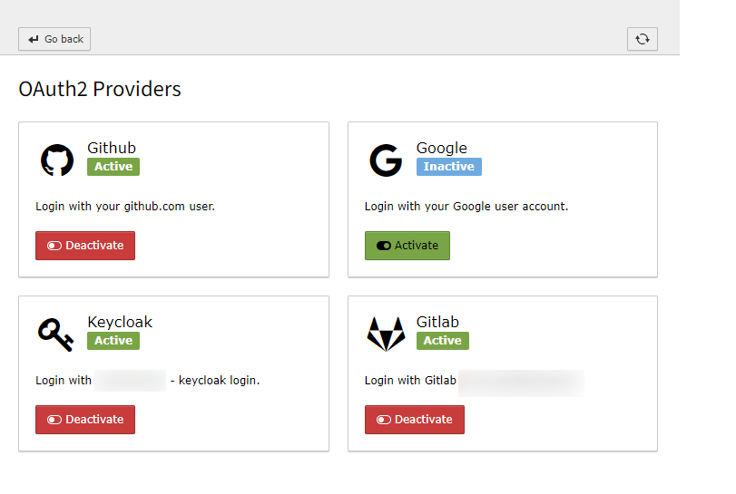
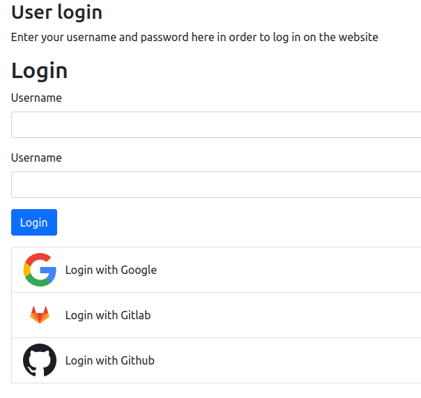
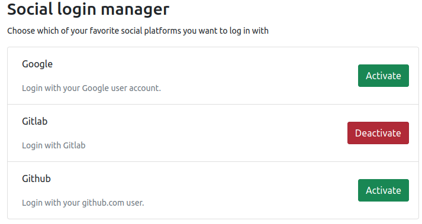

# FORK NOTICE: This package is a fork of https://github.com/waldhacker/ext-oauth2-client

**ATTENTION: You should use the original package. We at in2code GmbH are forking this extension to adapt it to our
needs. Code in this repo may change and even break without prior notice.**

# TYPO3 OAuth2 login client (backend and frontend)

Allow your frontend and backend users to add login possibilities via any OAuth2 provider. Popular examples are Github or
Gitlab, Google, Facebook or LinkedIn or classically self-hosted solutions like Keycloak.

The extension allows administrators/integrators to configure various providers and offers any frontend and/or backend
user an interface to add their OAuth2 based login.

This extension is especially powerful in combination with the Multi-Factor Capabilities of TYPO3 as you can provide
backend users with a single-sign-on login of their choice and add additional security of MFA
to TYPO3.

For more info, please refer to the documentation.

## Backend login

&nbsp;&nbsp;&nbsp;&nbsp;&nbsp;

## Frontend login

&nbsp;&nbsp;&nbsp;&nbsp;&nbsp;

## Quick Install

`composer req waldhacker/typo3-oauth2-client`

## Issues & Contributions

Find the code at https://github.com/waldhacker/ext-oauth2-client

Report issues at https://github.com/waldhacker/ext-oauth2-client/issues

### Security

If you learn about a potential security issue, please **always** contact us via security@waldhacker.dev and please **do
not** create a public visible issue.
Please always include the version number where you've discovered the issue.

Alternatively you can contact the TYPO3 Security Team via security@typo3.org.
Please always include the version number where you've discovered the issue.
For more details see [TYPO3 Security Team](https://typo3.org/community/teams/security/).
